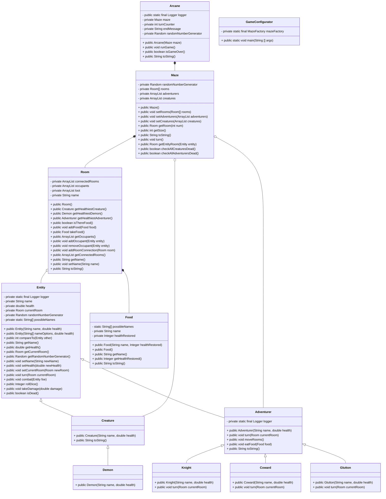
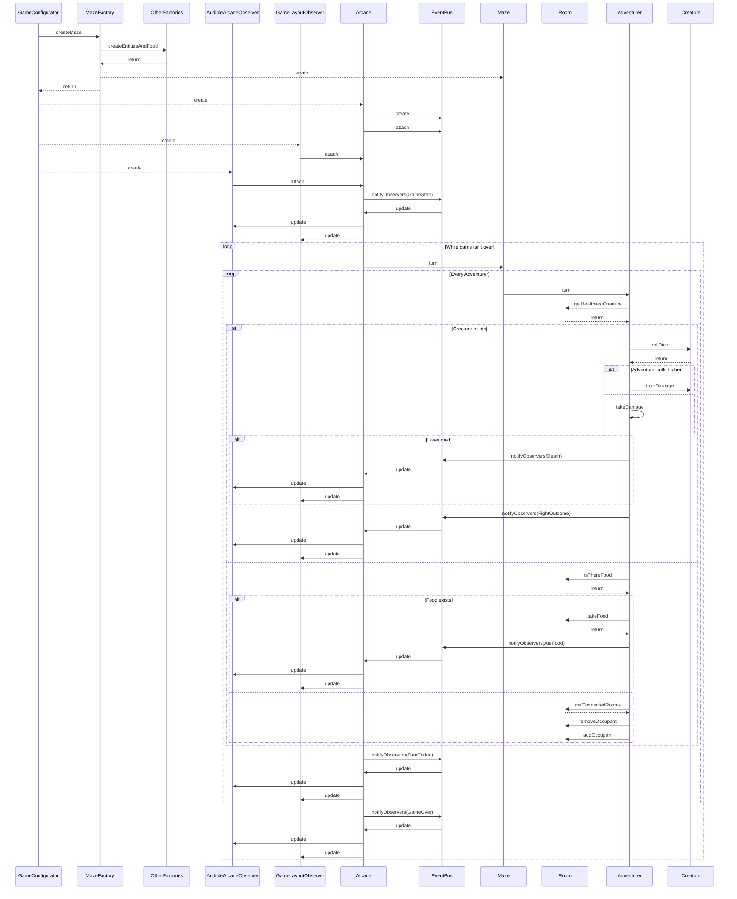

# ARCANE

Team Members:

1. Gavin Morrison
2. Jonathan Wu

Java Version: 17.0.10-tem

Description:
When the game is started, a 4 room maze is created, with both an Adventurer and a Monster being placed within random rooms. Each turn, the adventurer will either fight the monster in the room with him, or look for said monster if they aren't in the same room. When the fight happens, both combatants will roll a d6 each turn. We added a twist where whoever rolled higher doesn't just deal one damage, but deals damage equal to their dice roll. This continues until either the adventurer or monster have been slain.

UML Diagram:

Sequence Diagram:

