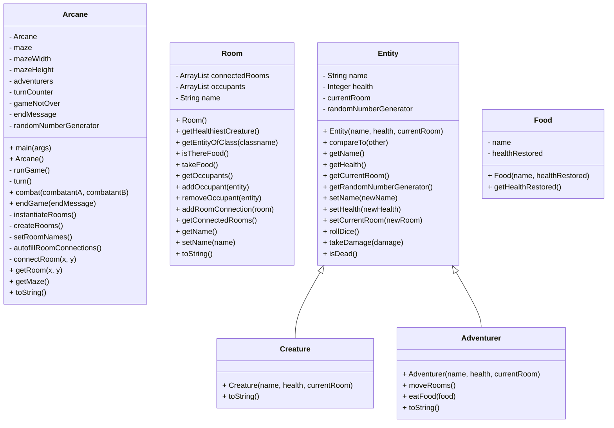

# Homework2 ARCANE-SetUp

Team Members:

1. Gavin Morrison
2. Jonathan Wu

Java Version: 17.0.10-tem

Description:
When the game is started, a 4 room maze is created, with both an Adventurer and a Monster being placed within random rooms. Each turn, the adventurer will either fight the monster in the room with him, or look for said monster if they aren't in the same room. When the fight happens, both combatants will roll a d6 each turn. We added a twist where whoever rolled higher doesn't just deal one damage, but deals damage equal to their dice roll. This continues until either the adventurer or monster have been slain.

Screenshots:


UML Diagram:

Output (note: our testing flushes the console between runs, so you only get this output from the main method):
### Run 1 (3x3 maze)
```
ARCANE MAZE: turn 1
NorthWest
loot: Apple Apple
North
Adventurer Sheri(health: 5) is here
loot: Apple
NorthEast
loot: Steak
West
loot:
Center
Creature Cobblebeast(health: 3) is here
loot:
East
Adventurer Zoe(health: 5) is here
loot: Apple Soup Burger
SouthWest
loot: Ice-Cream
South
loot: Burger
SouthEast
Creature Unruly Armor(health: 3) is here
loot: Cheese
Adventurer Sheri(health: 5) just ate a Apple
Adventurer Zoe(health: 5) just ate a Apple
ARCANE MAZE: turn 2
NorthWest
loot: Apple Apple
North
Adventurer Sheri(health: 6) is here
loot:
NorthEast
loot: Steak
West
loot:
Center
Creature Cobblebeast(health: 3) is here
loot:
East
Adventurer Zoe(health: 6) is here
loot: Soup Burger
SouthWest
loot: Ice-Cream
South
loot: Burger
SouthEast
Creature Unruly Armor(health: 3) is here
loot: Cheese
Adventurer Sheri(health: 6) moved from North to NorthWest
Adventurer Zoe(health: 6) just ate a Soup
ARCANE MAZE: turn 3
NorthWest
Adventurer Sheri(health: 6) is here
loot: Apple Apple
North
loot:
NorthEast
loot: Steak
West
loot:
Center
Creature Cobblebeast(health: 3) is here
loot:
East
Adventurer Zoe(health: 7) is here
loot: Burger
SouthWest
loot: Ice-Cream
South
loot: Burger
SouthEast
Creature Unruly Armor(health: 3) is here
loot: Cheese
Adventurer Zoe(health: 7) just ate a Burger
Adventurer Sheri(health: 6) just ate a Apple
ARCANE MAZE: turn 4
NorthWest
Adventurer Sheri(health: 7) is here
loot: Apple
North
loot:
NorthEast
loot: Steak
West
loot:
Center
Creature Cobblebeast(health: 3) is here
loot:
East
Adventurer Zoe(health: 8) is here
loot:
SouthWest
loot: Ice-Cream
South
loot: Burger
SouthEast
Creature Unruly Armor(health: 3) is here
loot: Cheese
Adventurer Zoe(health: 8) moved from East to SouthEast
Adventurer Sheri(health: 7) just ate a Apple
ARCANE MAZE: turn 5
NorthWest
Adventurer Sheri(health: 8) is here
loot:
North
loot:
NorthEast
loot: Steak
West
loot:
Center
Creature Cobblebeast(health: 3) is here
loot:
East
loot:
SouthWest
loot: Ice-Cream
South
loot: Burger
SouthEast
Creature Unruly Armor(health: 3) is here
Adventurer Zoe(health: 8) is here
loot: Cheese
Adventurer Zoe(health: 8) fought Creature Unruly Armor(health: 3)
Adventurer Zoe(health: 7) lost to Creature Unruly Armor(health: 3)
Adventurer Sheri(health: 8) moved from NorthWest to North
ARCANE MAZE: turn 6
NorthWest
loot:
North
Adventurer Sheri(health: 8) is here
loot:
NorthEast
loot: Steak
West
loot:
Center
Creature Cobblebeast(health: 3) is here
loot:
East
loot:
SouthWest
loot: Ice-Cream
South
loot: Burger
SouthEast
Adventurer Zoe(health: 7) is here
Creature Unruly Armor(health: 3) is here
loot: Cheese
Adventurer Sheri(health: 8) moved from North to NorthWest
Adventurer Zoe(health: 7) fought Creature Unruly Armor(health: 3)
Adventurer Zoe(health: 6) lost to Creature Unruly Armor(health: 3)
ARCANE MAZE: turn 7
NorthWest
Adventurer Sheri(health: 8) is here
loot:
North
loot:
NorthEast
loot: Steak
West
loot:
Center
Creature Cobblebeast(health: 3) is here
loot:
East
loot:
SouthWest
loot: Ice-Cream
South
loot: Burger
SouthEast
Adventurer Zoe(health: 6) is here
Creature Unruly Armor(health: 3) is here
loot: Cheese
Adventurer Sheri(health: 8) moved from NorthWest to West
Adventurer Zoe(health: 6) fought Creature Unruly Armor(health: 3)
ARCANE MAZE: turn 8
NorthWest
loot:
North
loot:
NorthEast
loot: Steak
West
Adventurer Sheri(health: 8) is here
loot:
Center
Creature Cobblebeast(health: 3) is here
loot:
East
loot:
SouthWest
loot: Ice-Cream
South
loot: Burger
SouthEast
Adventurer Zoe(health: 6) is here
Creature Unruly Armor(health: 3) is here
loot: Cheese
Adventurer Sheri(health: 8) moved from West to SouthWest
Adventurer Zoe(health: 6) fought Creature Unruly Armor(health: 3)
Adventurer Zoe(health: 3) lost to Creature Unruly Armor(health: 3)
ARCANE MAZE: turn 9
NorthWest
loot:
North
loot:
NorthEast
loot: Steak
West
loot:
Center
Creature Cobblebeast(health: 3) is here
loot:
East
loot:
SouthWest
Adventurer Sheri(health: 8) is here
loot: Ice-Cream
South
loot: Burger
SouthEast
Adventurer Zoe(health: 3) is here
Creature Unruly Armor(health: 3) is here
loot: Cheese
Adventurer Sheri(health: 8) just ate a Ice-Cream
Adventurer Zoe(health: 3) fought Creature Unruly Armor(health: 3)
Adventurer Zoe(health: 0); DEAD lost to Creature Unruly Armor(health: 3)
ARCANE MAZE: turn 10
NorthWest
loot:
North
loot:
NorthEast
loot: Steak
West
loot:
Center
Creature Cobblebeast(health: 3) is here
loot:
East
loot:
SouthWest
Adventurer Sheri(health: 9) is here
loot:
South
loot: Burger
SouthEast
Adventurer Zoe(health: 0); DEAD is here
Creature Unruly Armor(health: 3) is here
loot: Cheese
Adventurer Sheri(health: 9) moved from SouthWest to South
ARCANE MAZE: turn 11
NorthWest
loot:
North
loot:
NorthEast
loot: Steak
West
loot:
Center
Creature Cobblebeast(health: 3) is here
loot:
East
loot:
SouthWest
loot:
South
Adventurer Sheri(health: 9) is here
loot: Burger
SouthEast
Adventurer Zoe(health: 0); DEAD is here
Creature Unruly Armor(health: 3) is here
loot: Cheese
Adventurer Sheri(health: 9) just ate a Burger
ARCANE MAZE: turn 12
NorthWest
loot:
North
loot:
NorthEast
loot: Steak
West
loot:
Center
Creature Cobblebeast(health: 3) is here
loot:
East
loot:
SouthWest
loot:
South
Adventurer Sheri(health: 10) is here
loot:
SouthEast
Adventurer Zoe(health: 0); DEAD is here
Creature Unruly Armor(health: 3) is here
loot: Cheese
Adventurer Sheri(health: 10) moved from South to SouthEast
ARCANE MAZE: turn 13
NorthWest
loot:
North
loot:
NorthEast
loot: Steak
West
loot:
Center
Creature Cobblebeast(health: 3) is here
loot:
East
loot:
SouthWest
loot:
South
loot:
SouthEast
Adventurer Zoe(health: 0); DEAD is here
Creature Unruly Armor(health: 3) is here
Adventurer Sheri(health: 10) is here
loot: Cheese
Adventurer Sheri(health: 10) fought Creature Unruly Armor(health: 3)
Adventurer Sheri(health: 5) lost to Creature Unruly Armor(health: 3)
ARCANE MAZE: turn 14
NorthWest
loot:
North
loot:
NorthEast
loot: Steak
West
loot:
Center
Creature Cobblebeast(health: 3) is here
loot:
East
loot:
SouthWest
loot:
South
loot:
SouthEast
Adventurer Sheri(health: 5) is here
Creature Unruly Armor(health: 3) is here
Adventurer Zoe(health: 0); DEAD is here
loot: Cheese
Adventurer Sheri(health: 5) fought Creature Unruly Armor(health: 3)
Adventurer Sheri(health: 4) lost to Creature Unruly Armor(health: 3)
ARCANE MAZE: turn 15
NorthWest
loot:
North
loot:
NorthEast
loot: Steak
West
loot:
Center
Creature Cobblebeast(health: 3) is here
loot:
East
loot:
SouthWest
loot:
South
loot:
SouthEast
Adventurer Sheri(health: 4) is here
Creature Unruly Armor(health: 3) is here
Adventurer Zoe(health: 0); DEAD is here
loot: Cheese
Adventurer Sheri(health: 4) fought Creature Unruly Armor(health: 3)
Adventurer Sheri(health: 2) lost to Creature Unruly Armor(health: 3)
ARCANE MAZE: turn 16
NorthWest
loot:
North
loot:
NorthEast
loot: Steak
West
loot:
Center
Creature Cobblebeast(health: 3) is here
loot:
East
loot:
SouthWest
loot:
South
loot:
SouthEast
Adventurer Sheri(health: 2) is here
Creature Unruly Armor(health: 3) is here
Adventurer Zoe(health: 0); DEAD is here
loot: Cheese
Adventurer Sheri(health: 2) fought Creature Unruly Armor(health: 3)
Creature Unruly Armor(health: 2) lost to Adventurer Sheri(health: 2)
ARCANE MAZE: turn 17
NorthWest
loot:
North
loot:
NorthEast
loot: Steak
West
loot:
Center
Creature Cobblebeast(health: 3) is here
loot:
East
loot:
SouthWest
loot:
South
loot:
SouthEast
Creature Unruly Armor(health: 2) is here
Adventurer Sheri(health: 2) is here
Adventurer Zoe(health: 0); DEAD is here
loot: Cheese
Adventurer Sheri(health: 2) fought Creature Unruly Armor(health: 2)
ARCANE MAZE: turn 18
NorthWest
loot:
North
loot:
NorthEast
loot: Steak
West
loot:
Center
Creature Cobblebeast(health: 3) is here
loot:
East
loot:
SouthWest
loot:
South
loot:
SouthEast
Creature Unruly Armor(health: 2) is here
Adventurer Sheri(health: 2) is here
Adventurer Zoe(health: 0); DEAD is here
loot: Cheese
Adventurer Sheri(health: 2) fought Creature Unruly Armor(health: 2)
Creature Unruly Armor(health: 1) lost to Adventurer Sheri(health: 2)
ARCANE MAZE: turn 19
NorthWest
loot:
North
loot:
NorthEast
loot: Steak
West
loot:
Center
Creature Cobblebeast(health: 3) is here
loot:
East
loot:
SouthWest
loot:
South
loot:
SouthEast
Creature Unruly Armor(health: 1) is here
Adventurer Sheri(health: 2) is here
Adventurer Zoe(health: 0); DEAD is here
loot: Cheese
Adventurer Sheri(health: 2) fought Creature Unruly Armor(health: 1)
Creature Unruly Armor(health: 0); DEAD was killed
Creature Unruly Armor(health: 0); DEAD lost to Adventurer Sheri(health: 2)
ARCANE MAZE: turn 20
NorthWest
loot:
North
loot:
NorthEast
loot: Steak
West
loot:
Center
Creature Cobblebeast(health: 3) is here
loot:
East
loot:
SouthWest
loot:
South
loot:
SouthEast
Adventurer Sheri(health: 2) is here
Creature Unruly Armor(health: 0); DEAD is here
Adventurer Zoe(health: 0); DEAD is here
loot: Cheese
Adventurer Sheri(health: 2) just ate a Cheese
ARCANE MAZE: turn 21
NorthWest
loot:
North
loot:
NorthEast
loot: Steak
West
loot:
Center
Creature Cobblebeast(health: 3) is here
loot:
East
loot:
SouthWest
loot:
South
loot:
SouthEast
Adventurer Sheri(health: 3) is here
Creature Unruly Armor(health: 0); DEAD is here
Adventurer Zoe(health: 0); DEAD is here
loot:
Adventurer Sheri(health: 3) moved from SouthEast to South
ARCANE MAZE: turn 22
NorthWest
loot:
North
loot:
NorthEast
loot: Steak
West
loot:
Center
Creature Cobblebeast(health: 3) is here
loot:
East
loot:
SouthWest
loot:
South
Adventurer Sheri(health: 3) is here
loot:
SouthEast
Creature Unruly Armor(health: 0); DEAD is here
Adventurer Zoe(health: 0); DEAD is here
loot:
Adventurer Sheri(health: 3) moved from South to Center
ARCANE MAZE: turn 23
NorthWest
loot:
North
loot:
NorthEast
loot: Steak
West
loot:
Center
Creature Cobblebeast(health: 3) is here
Adventurer Sheri(health: 3) is here
loot:
East
loot:
SouthWest
loot:
South
loot:
SouthEast
Creature Unruly Armor(health: 0); DEAD is here
Adventurer Zoe(health: 0); DEAD is here
loot:
Adventurer Sheri(health: 3) fought Creature Cobblebeast(health: 3)
Creature Cobblebeast(health: 0); DEAD was killed
Creature Cobblebeast(health: 0); DEAD lost to Adventurer Sheri(health: 3)
ARCANE MAZE: turn 24
NorthWest
loot:
North
loot:
NorthEast
loot: Steak
West
loot:
Center
Creature Cobblebeast(health: 0); DEAD is here
Adventurer Sheri(health: 3) is here
loot:
East
loot:
SouthWest
loot:
South
loot:
SouthEast
Creature Unruly Armor(health: 0); DEAD is here
Adventurer Zoe(health: 0); DEAD is here
loot:
The Adventurers have triumphed!
```
### Run 2 (3x3 maze)
```
ARCANE MAZE: turn 1
  NorthWest
    loot: Spaghetti
  North
    loot: Cake Cake
  NorthEast
    loot: Ice-Cream Cake Burger Soup
  West
    loot: Cake
  Center
    Adventurer Carl(health: 5) is here
    loot:
  East
    loot: Burger
  SouthWest
    Adventurer Bill(health: 5) is here
    Creature Unruly Armor(health: 3) is here
    loot:
  South
    loot: Steak
  SouthEast
    Creature Ooze(health: 3) is here
    loot:
Adventurer Bill(health: 5) fought Creature Unruly Armor(health: 3)
Adventurer Bill(health: 4) lost to Creature Unruly Armor(health: 3)
Adventurer Carl(health: 5) moved from Center to North
ARCANE MAZE: turn 2
  NorthWest
    loot: Spaghetti
  North
    Adventurer Carl(health: 5) is here
    loot: Cake Cake
  NorthEast
    loot: Ice-Cream Cake Burger Soup
  West
    loot: Cake
  Center
    loot:
  East
    loot: Burger
  SouthWest
    Adventurer Bill(health: 4) is here
    Creature Unruly Armor(health: 3) is here
    loot:
  South
    loot: Steak
  SouthEast
    Creature Ooze(health: 3) is here
    loot:
Adventurer Carl(health: 5) just ate a Cake
Adventurer Bill(health: 4) fought Creature Unruly Armor(health: 3)
Creature Unruly Armor(health: 1) lost to Adventurer Bill(health: 4)
ARCANE MAZE: turn 3
  NorthWest
    loot: Spaghetti
  North
    Adventurer Carl(health: 6) is here
    loot: Cake
  NorthEast
    loot: Ice-Cream Cake Burger Soup
  West
    loot: Cake
  Center
    loot:
  East
    loot: Burger
  SouthWest
    Adventurer Bill(health: 4) is here
    Creature Unruly Armor(health: 1) is here
    loot:
  South
    loot: Steak
  SouthEast
    Creature Ooze(health: 3) is here
    loot:
Adventurer Carl(health: 6) just ate a Cake
Adventurer Bill(health: 4) fought Creature Unruly Armor(health: 1)
Adventurer Bill(health: 2) lost to Creature Unruly Armor(health: 1)
ARCANE MAZE: turn 4
  NorthWest
    loot: Spaghetti
  North
    Adventurer Carl(health: 7) is here
    loot:
  NorthEast
    loot: Ice-Cream Cake Burger Soup
  West
    loot: Cake
  Center
    loot:
  East
    loot: Burger
  SouthWest
    Adventurer Bill(health: 2) is here
    Creature Unruly Armor(health: 1) is here
    loot:
  South
    loot: Steak
  SouthEast
    Creature Ooze(health: 3) is here
    loot:
Adventurer Carl(health: 7) moved from North to Center
Adventurer Bill(health: 2) fought Creature Unruly Armor(health: 1)
Creature Unruly Armor(health: 0); DEAD was killed
Creature Unruly Armor(health: 0); DEAD lost to Adventurer Bill(health: 2)
ARCANE MAZE: turn 5
  NorthWest
    loot: Spaghetti
  North
    loot:
  NorthEast
    loot: Ice-Cream Cake Burger Soup
  West
    loot: Cake
  Center
    Adventurer Carl(health: 7) is here
    loot:
  East
    loot: Burger
  SouthWest
    Adventurer Bill(health: 2) is here
    Creature Unruly Armor(health: 0); DEAD is here
    loot:
  South
    loot: Steak
  SouthEast
    Creature Ooze(health: 3) is here
    loot:
Adventurer Carl(health: 7) moved from Center to East
Adventurer Bill(health: 2) moved from SouthWest to South
ARCANE MAZE: turn 6
  NorthWest
    loot: Spaghetti
  North
    loot:
  NorthEast
    loot: Ice-Cream Cake Burger Soup
  West
    loot: Cake
  Center
    loot:
  East
    Adventurer Carl(health: 7) is here
    loot: Burger
  SouthWest
    Creature Unruly Armor(health: 0); DEAD is here
    loot:
  South
    Adventurer Bill(health: 2) is here
    loot: Steak
  SouthEast
    Creature Ooze(health: 3) is here
    loot:
Adventurer Carl(health: 7) just ate a Burger
Adventurer Bill(health: 2) just ate a Steak
ARCANE MAZE: turn 7
  NorthWest
    loot: Spaghetti
  North
    loot:
  NorthEast
    loot: Ice-Cream Cake Burger Soup
  West
    loot: Cake
  Center
    loot:
  East
    Adventurer Carl(health: 8) is here
    loot:
  SouthWest
    Creature Unruly Armor(health: 0); DEAD is here
    loot:
  South
    Adventurer Bill(health: 3) is here
    loot:
  SouthEast
    Creature Ooze(health: 3) is here
    loot:
Adventurer Carl(health: 8) moved from East to Center
Adventurer Bill(health: 3) moved from South to SouthEast
ARCANE MAZE: turn 8
  NorthWest
    loot: Spaghetti
  North
    loot:
  NorthEast
    loot: Ice-Cream Cake Burger Soup
  West
    loot: Cake
  Center
    Adventurer Carl(health: 8) is here
    loot:
  East
    loot:
  SouthWest
    Creature Unruly Armor(health: 0); DEAD is here
    loot:
  South
    loot:
  SouthEast
    Creature Ooze(health: 3) is here
    Adventurer Bill(health: 3) is here
    loot:
Adventurer Carl(health: 8) moved from Center to South
Adventurer Bill(health: 3) fought Creature Ooze(health: 3)
Creature Ooze(health: 1) lost to Adventurer Bill(health: 3)
ARCANE MAZE: turn 9
  NorthWest
    loot: Spaghetti
  North
    loot:
  NorthEast
    loot: Ice-Cream Cake Burger Soup
  West
    loot: Cake
  Center
    loot:
  East
    loot:
  SouthWest
    Creature Unruly Armor(health: 0); DEAD is here
    loot:
  South
    Adventurer Carl(health: 8) is here
    loot:
  SouthEast
    Creature Ooze(health: 1) is here
    Adventurer Bill(health: 3) is here
    loot:
Adventurer Carl(health: 8) moved from South to Center
Adventurer Bill(health: 3) fought Creature Ooze(health: 1)
Creature Ooze(health: 0); DEAD was killed
Creature Ooze(health: 0); DEAD lost to Adventurer Bill(health: 3)
ARCANE MAZE: turn 10
  NorthWest
    loot: Spaghetti
  North
    loot:
  NorthEast
    loot: Ice-Cream Cake Burger Soup
  West
    loot: Cake
  Center
    Adventurer Carl(health: 8) is here
    loot:
  East
    loot:
  SouthWest
    Creature Unruly Armor(health: 0); DEAD is here
    loot:
  South
    loot:
  SouthEast
    Adventurer Bill(health: 3) is here
    Creature Ooze(health: 0); DEAD is here
    loot:
The Adventurers have triumphed!
```
### Run 3 (2x2 maze)
```
ARCANE MAZE: turn 1
  NorthWest
    Adventurer Zoe(health: 5) is here
    loot:
  NorthEast
    loot: Cheese Cake
  SouthWest
    loot:
  SouthEast
    Creature Unruly Armor(health: 3) is here
    loot: Ice-Cream Steak
Adventurer Zoe(health: 5) moved from NorthWest to NorthEast
ARCANE MAZE: turn 2
  NorthWest
    loot:
  NorthEast
    Adventurer Zoe(health: 5) is here
    loot: Cheese Cake
  SouthWest
    loot:
  SouthEast
    Creature Unruly Armor(health: 3) is here
    loot: Ice-Cream Steak
Adventurer Zoe(health: 5) just ate a Cheese
ARCANE MAZE: turn 3
  NorthWest
    loot:
  NorthEast
    Adventurer Zoe(health: 6) is here
    loot: Cake
  SouthWest
    loot:
  SouthEast
    Creature Unruly Armor(health: 3) is here
    loot: Ice-Cream Steak
Adventurer Zoe(health: 6) just ate a Cake
ARCANE MAZE: turn 4
  NorthWest
    loot:
  NorthEast
    Adventurer Zoe(health: 7) is here
    loot:
  SouthWest
    loot:
  SouthEast
    Creature Unruly Armor(health: 3) is here
    loot: Ice-Cream Steak
Adventurer Zoe(health: 7) moved from NorthEast to SouthEast
ARCANE MAZE: turn 5
  NorthWest
    loot:
  NorthEast
    loot:
  SouthWest
    loot:
  SouthEast
    Creature Unruly Armor(health: 3) is here
    Adventurer Zoe(health: 7) is here
    loot: Ice-Cream Steak
Adventurer Zoe(health: 7) fought Creature Unruly Armor(health: 3)
Adventurer Zoe(health: 6) lost to Creature Unruly Armor(health: 3)
ARCANE MAZE: turn 6
  NorthWest
    loot:
  NorthEast
    loot:
  SouthWest
    loot:
  SouthEast
    Adventurer Zoe(health: 6) is here
    Creature Unruly Armor(health: 3) is here
    loot: Ice-Cream Steak
Adventurer Zoe(health: 6) fought Creature Unruly Armor(health: 3)
Adventurer Zoe(health: 5) lost to Creature Unruly Armor(health: 3)
ARCANE MAZE: turn 7
  NorthWest
    loot:
  NorthEast
    loot:
  SouthWest
    loot:
  SouthEast
    Adventurer Zoe(health: 5) is here
    Creature Unruly Armor(health: 3) is here
    loot: Ice-Cream Steak
Adventurer Zoe(health: 5) fought Creature Unruly Armor(health: 3)
Adventurer Zoe(health: 4) lost to Creature Unruly Armor(health: 3)
ARCANE MAZE: turn 8
  NorthWest
    loot:
  NorthEast
    loot:
  SouthWest
    loot:
  SouthEast
    Adventurer Zoe(health: 4) is here
    Creature Unruly Armor(health: 3) is here
    loot: Ice-Cream Steak
Adventurer Zoe(health: 4) fought Creature Unruly Armor(health: 3)
Creature Unruly Armor(health: 0); DEAD was killed
Creature Unruly Armor(health: 0); DEAD lost to Adventurer Zoe(health: 4)
ARCANE MAZE: turn 9
  NorthWest
    loot:
  NorthEast
    loot:
  SouthWest
    loot:
  SouthEast
    Adventurer Zoe(health: 4) is here
    Creature Unruly Armor(health: 0); DEAD is here
    loot: Ice-Cream Steak
The Adventurers have triumphed!
```