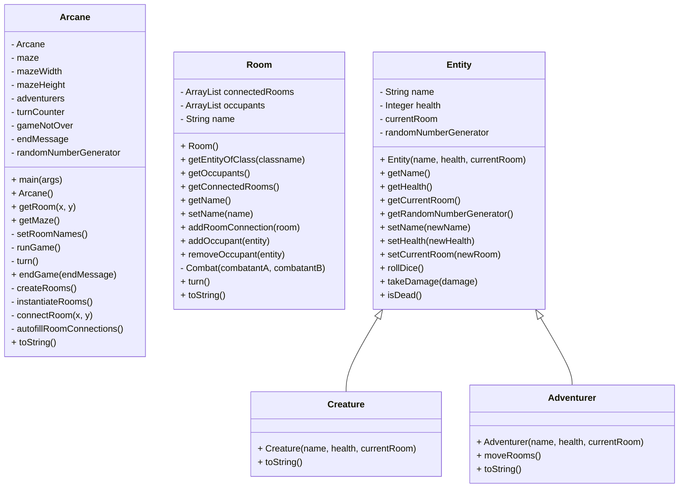

# Homework2 ARCANE-SetUp

Team Members:

1. Gavin Morrison
2. Jonathan Wu

Java Version: 17.0.10-tem

Comments / Descriptions:

```mermaid
classDiagram
    class Arcane {
        - Arcane
        - maze
        - mazeWidth
        - mazeHeight
        - adventurers
        - turnCounter
        - gameNotOver
        - endMessage
        - randomNumberGenerator
        + main(args)
        + Arcane()
        + getRoom(x, y)
        + getMaze()
        - setRoomNames()
        - runGame()
        - turn()
        + endGame(endMessage)
        - createRooms()
        - instantiateRooms()
        - connectRoom(x, y)
        - autofillRoomConnections()
        + toString()
    }
    class Room {
        - ArrayList<Room> connectedRooms
        - ArrayList<Entity> occupants
        - String name
        + Room()
        + getEntityOfClass(classname)
        + getOccupants()
        + getConnectedRooms()
        + getName()
        + setName(name)
        + addRoomConnection(room)
        + addOccupant(entity)
        + removeOccupant(entity)
        - Combat(combatantA, combatantB)
        + turn()
        + toString()
    }
    class Entity {
        - String name
        - Integer health
        - currentRoom
        - randomNumberGenerator
        + Entity(name, health, currentRoom)
        + getName()
        + getHealth()
        + getCurrentRoom()
        + getRandomNumberGenerator()
        + setName(newName)
        + setHealth(newHealth)
        + setCurrentRoom(newRoom)
        + rollDice()
        + takeDamage(damage)
        + isDead()
    }
    class Adventurer {
        + Adventurer(name, health, currentRoom)
        + moveRooms()
        + toString()
    }
    class Creature {
        + Creature(name, health, currentRoom)
        + toString()
    }
    Entity <|-- Creature
    Entity <|-- Adventurer
```