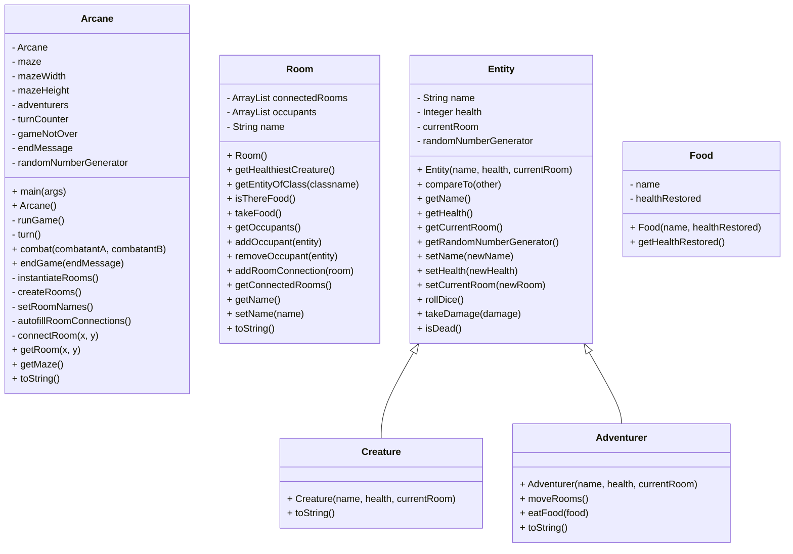

# Homework2 ARCANE-SetUp

Team Members:

1. Gavin Morrison
2. Jonathan Wu

Java Version: 17.0.10-tem

Description:
When the game is started, a 4 room maze is created, with both an Adventurer and a Monster being placed within random rooms. Each turn, the adventurer will either fight the monster in the room with him, or look for said monster if they aren't in the same room. When the fight happens, both combatants will roll a d6 each turn. We added a twist where whoever rolled higher doesn't just deal one damage, but deals damage equal to their dice roll. This continues until either the adventurer or monster have been slain.

Screenshots:


UML Diagram:

Output (note: our testing flushes the console between runs, so you only get this output from the main method):
### Running the Game with command line arguments from GameConfiguratorTest.java
```
ARCANE MAZE: turn 1
  Room 1
    Creature Unruly Armor(health: 3.0) is here
    loot:
  Room 2
    Adventurer Bill(health: 5.0) is here
    Creature Snapdragon(health: 3.0) is here
    loot: Carrot
  Room 3
    loot: Ice-Cream
  Room 4
    loot: Soup
  Room 5
    Adventurer Bob(health: 5.0) is here
    loot:
Adventurer Bill(health: 5.0) fought Creature Snapdragon(health: 3.0)
Adventurer Bob(health: 5.0) moved from Room 5 to Room 1
ARCANE MAZE: turn 2
  Room 1
    Creature Unruly Armor(health: 3.0) is here
    Adventurer Bob(health: 5.0) is here
    loot:
  Room 2
    Adventurer Bill(health: 5.0) is here
    Creature Snapdragon(health: 3.0) is here
    loot: Carrot
  Room 3
    loot: Ice-Cream
  Room 4
    loot: Soup
  Room 5
    loot:
Adventurer Bill(health: 5.0) fought Creature Snapdragon(health: 3.0)
Adventurer Bill(health: 3.0) lost to Creature Snapdragon(health: 3.0)
Adventurer Bob(health: 5.0) fought Creature Unruly Armor(health: 3.0)
Creature Unruly Armor(health: 0.0); DEAD was killed
Creature Unruly Armor(health: 0.0); DEAD lost to Adventurer Bob(health: 5.0)
ARCANE MAZE: turn 3
  Room 1
    Adventurer Bob(health: 5.0) is here
    Creature Unruly Armor(health: 0.0); DEAD is here
    loot:
  Room 2
    Adventurer Bill(health: 3.0) is here
    Creature Snapdragon(health: 3.0) is here
    loot: Carrot
  Room 3
    loot: Ice-Cream
  Room 4
    loot: Soup
  Room 5
    loot:
Adventurer Bob(health: 5.0) moved from Room 1 to Room 3
Adventurer Bill(health: 3.0) fought Creature Snapdragon(health: 3.0)
ARCANE MAZE: turn 4
  Room 1
    Creature Unruly Armor(health: 0.0); DEAD is here
    loot:
  Room 2
    Adventurer Bill(health: 3.0) is here
    Creature Snapdragon(health: 3.0) is here
    loot: Carrot
  Room 3
    Adventurer Bob(health: 5.0) is here
    loot: Ice-Cream
  Room 4
    loot: Soup
  Room 5
    loot:
Adventurer Bob(health: 5.0) just ate a Ice-Cream
Adventurer Bill(health: 3.0) fought Creature Snapdragon(health: 3.0)
Adventurer Bill(health: 2.0) lost to Creature Snapdragon(health: 3.0)
ARCANE MAZE: turn 5
  Room 1
    Creature Unruly Armor(health: 0.0); DEAD is here
    loot:
  Room 2
    Adventurer Bill(health: 2.0) is here
    Creature Snapdragon(health: 3.0) is here
    loot: Carrot
  Room 3
    Adventurer Bob(health: 6.0) is here
    loot:
  Room 4
    loot: Soup
  Room 5
    loot:
Adventurer Bob(health: 6.0) moved from Room 3 to Room 4
Adventurer Bill(health: 2.0) fought Creature Snapdragon(health: 3.0)
Creature Snapdragon(health: 2.0) lost to Adventurer Bill(health: 2.0)
ARCANE MAZE: turn 6
  Room 1
    Creature Unruly Armor(health: 0.0); DEAD is here
    loot:
  Room 2
    Creature Snapdragon(health: 2.0) is here
    Adventurer Bill(health: 2.0) is here
    loot: Carrot
  Room 3
    loot:
  Room 4
    Adventurer Bob(health: 6.0) is here
    loot: Soup
  Room 5
    loot:
Adventurer Bob(health: 6.0) just ate a Soup
Adventurer Bill(health: 2.0) fought Creature Snapdragon(health: 2.0)
Adventurer Bill(health: 0.0); DEAD was killed
Adventurer Bill(health: 0.0); DEAD lost to Creature Snapdragon(health: 2.0)
ARCANE MAZE: turn 7
  Room 1
    Creature Unruly Armor(health: 0.0); DEAD is here
    loot:
  Room 2
    Creature Snapdragon(health: 2.0) is here
    Adventurer Bill(health: 0.0); DEAD is here
    loot: Carrot
  Room 3
    loot:
  Room 4
    Adventurer Bob(health: 7.0) is here
    loot:
  Room 5
    loot:
Adventurer Bob(health: 7.0) moved from Room 4 to Room 2
ARCANE MAZE: turn 8
  Room 1
    Creature Unruly Armor(health: 0.0); DEAD is here
    loot:
  Room 2
    Creature Snapdragon(health: 2.0) is here
    Adventurer Bill(health: 0.0); DEAD is here
    Adventurer Bob(health: 7.0) is here
    loot: Carrot
  Room 3
    loot:
  Room 4
    loot:
  Room 5
    loot:
Adventurer Bob(health: 7.0) fought Creature Snapdragon(health: 2.0)
Adventurer Bob(health: 4.0) lost to Creature Snapdragon(health: 2.0)
ARCANE MAZE: turn 9
  Room 1
    Creature Unruly Armor(health: 0.0); DEAD is here
    loot:
  Room 2
    Adventurer Bob(health: 4.0) is here
    Creature Snapdragon(health: 2.0) is here
    Adventurer Bill(health: 0.0); DEAD is here
    loot: Carrot
  Room 3
    loot:
  Room 4
    loot:
  Room 5
    loot:
Adventurer Bob(health: 4.0) fought Creature Snapdragon(health: 2.0)
Adventurer Bob(health: 2.0) lost to Creature Snapdragon(health: 2.0)
ARCANE MAZE: turn 10
  Room 1
    Creature Unruly Armor(health: 0.0); DEAD is here
    loot:
  Room 2
    Adventurer Bob(health: 2.0) is here
    Creature Snapdragon(health: 2.0) is here
    Adventurer Bill(health: 0.0); DEAD is here
    loot: Carrot
  Room 3
    loot:
  Room 4
    loot:
  Room 5
    loot:
Adventurer Bob(health: 2.0) fought Creature Snapdragon(health: 2.0)
Creature Snapdragon(health: 1.0) lost to Adventurer Bob(health: 2.0)
ARCANE MAZE: turn 11
  Room 1
    Creature Unruly Armor(health: 0.0); DEAD is here
    loot:
  Room 2
    Adventurer Bob(health: 2.0) is here
    Creature Snapdragon(health: 1.0) is here
    Adventurer Bill(health: 0.0); DEAD is here
    loot: Carrot
  Room 3
    loot:
  Room 4
    loot:
  Room 5
    loot:
Adventurer Bob(health: 2.0) fought Creature Snapdragon(health: 1.0)
Adventurer Bob(health: 0.0); DEAD was killed
Adventurer Bob(health: 0.0); DEAD lost to Creature Snapdragon(health: 1.0)
ARCANE MAZE: turn 12
  Room 1
    Creature Unruly Armor(health: 0.0); DEAD is here
    loot:
  Room 2
    Adventurer Bob(health: 0.0); DEAD is here
    Creature Snapdragon(health: 1.0) is here
    Adventurer Bill(health: 0.0); DEAD is here
    loot: Carrot
  Room 3
    loot:
  Room 4
    loot:
  Room 5
    loot:
The Adventurers have died horribly!
```
### Running the big grid from ArcaneTest.runBigGridGameTest()
```
ARCANE MAZE: turn 1
  NorthWest
    loot: Steak Soup Carrot Burger
  North
    loot:
  NorthEast
    loot: Spaghetti
  West
    Creature Dimcreeper(health: 3.0) is here
    loot: Burger
  Center
    Adventurer Gorby(health: 3.0) is here
    loot: Burger
  East
    loot: Spaghetti Steak
  SouthWest
    loot:
  South
    Adventurer Ted(health: 5.0) is here
    loot: Spaghetti
  SouthEast
    Creature Cobblebeast(health: 3.0) is here
    loot:
Adventurer Ted(health: 5.0) just ate a Spaghetti
Adventurer Gorby(health: 3.0) just ate a Burger
ARCANE MAZE: turn 2
  NorthWest
    loot: Steak Soup Carrot Burger
  North
    loot:
  NorthEast
    loot: Spaghetti
  West
    Creature Dimcreeper(health: 3.0) is here
    loot: Burger
  Center
    Adventurer Gorby(health: 4.0) is here
    loot:
  East
    loot: Spaghetti Steak
  SouthWest
    loot:
  South
    Adventurer Ted(health: 6.0) is here
    loot:
  SouthEast
    Creature Cobblebeast(health: 3.0) is here
    loot:
Adventurer Ted(health: 6.0) moved from South to Center
Adventurer Gorby(health: 4.0) moved from Center to East
ARCANE MAZE: turn 3
  NorthWest
    loot: Steak Soup Carrot Burger
  North
    loot:
  NorthEast
    loot: Spaghetti
  West
    Creature Dimcreeper(health: 3.0) is here
    loot: Burger
  Center
    Adventurer Ted(health: 6.0) is here
    loot:
  East
    Adventurer Gorby(health: 4.0) is here
    loot: Spaghetti Steak
  SouthWest
    loot:
  South
    loot:
  SouthEast
    Creature Cobblebeast(health: 3.0) is here
    loot:
Adventurer Ted(health: 6.0) moved from Center to East
Adventurer Gorby(health: 4.0) just ate a Spaghetti
ARCANE MAZE: turn 4
  NorthWest
    loot: Steak Soup Carrot Burger
  North
    loot:
  NorthEast
    loot: Spaghetti
  West
    Creature Dimcreeper(health: 3.0) is here
    loot: Burger
  Center
    loot:
  East
    Adventurer Ted(health: 6.0) is here
    Adventurer Gorby(health: 5.0) is here
    loot: Steak
  SouthWest
    loot:
  South
    loot:
  SouthEast
    Creature Cobblebeast(health: 3.0) is here
    loot:
Adventurer Ted(health: 6.0) just ate a Steak
Adventurer Gorby(health: 5.0) moved from East to SouthEast
ARCANE MAZE: turn 5
  NorthWest
    loot: Steak Soup Carrot Burger
  North
    loot:
  NorthEast
    loot: Spaghetti
  West
    Creature Dimcreeper(health: 3.0) is here
    loot: Burger
  Center
    loot:
  East
    Adventurer Ted(health: 7.0) is here
    loot:
  SouthWest
    loot:
  South
    loot:
  SouthEast
    Creature Cobblebeast(health: 3.0) is here
    Adventurer Gorby(health: 5.0) is here
    loot:
Adventurer Ted(health: 7.0) moved from East to SouthWest
Adventurer Gorby(health: 5.0) fought Creature Cobblebeast(health: 3.0)
Adventurer Gorby(health: 4.0) lost to Creature Cobblebeast(health: 3.0)
ARCANE MAZE: turn 6
  NorthWest
    loot: Steak Soup Carrot Burger
  North
    loot:
  NorthEast
    loot: Spaghetti
  West
    Creature Dimcreeper(health: 3.0) is here
    loot: Burger
  Center
    loot:
  East
    loot:
  SouthWest
    Adventurer Ted(health: 7.0) is here
    loot:
  South
    loot:
  SouthEast
    Adventurer Gorby(health: 4.0) is here
    Creature Cobblebeast(health: 3.0) is here
    loot:
Adventurer Ted(health: 7.0) moved from SouthWest to West
Adventurer Gorby(health: 4.0) fought Creature Cobblebeast(health: 3.0)
Adventurer Gorby(health: 3.0) lost to Creature Cobblebeast(health: 3.0)
ARCANE MAZE: turn 7
  NorthWest
    loot: Steak Soup Carrot Burger
  North
    loot:
  NorthEast
    loot: Spaghetti
  West
    Creature Dimcreeper(health: 3.0) is here
    Adventurer Ted(health: 7.0) is here
    loot: Burger
  Center
    loot:
  East
    loot:
  SouthWest
    loot:
  South
    loot:
  SouthEast
    Adventurer Gorby(health: 3.0) is here
    Creature Cobblebeast(health: 3.0) is here
    loot:
Adventurer Ted(health: 7.0) fought Creature Dimcreeper(health: 3.0)
Adventurer Gorby(health: 3.0) fought Creature Cobblebeast(health: 3.0)
Adventurer Gorby(health: 1.0) lost to Creature Cobblebeast(health: 3.0)
ARCANE MAZE: turn 8
  NorthWest
    loot: Steak Soup Carrot Burger
  North
    loot:
  NorthEast
    loot: Spaghetti
  West
    Adventurer Ted(health: 7.0) is here
    Creature Dimcreeper(health: 3.0) is here
    loot: Burger
  Center
    loot:
  East
    loot:
  SouthWest
    loot:
  South
    loot:
  SouthEast
    Adventurer Gorby(health: 1.0) is here
    Creature Cobblebeast(health: 3.0) is here
    loot:
Adventurer Ted(health: 7.0) fought Creature Dimcreeper(health: 3.0)
Adventurer Ted(health: 5.0) lost to Creature Dimcreeper(health: 3.0)
Adventurer Gorby(health: 1.0) fought Creature Cobblebeast(health: 3.0)
Creature Cobblebeast(health: 0.0); DEAD was killed
Creature Cobblebeast(health: 0.0); DEAD lost to Adventurer Gorby(health: 1.0)
ARCANE MAZE: turn 9
  NorthWest
    loot: Steak Soup Carrot Burger
  North
    loot:
  NorthEast
    loot: Spaghetti
  West
    Adventurer Ted(health: 5.0) is here
    Creature Dimcreeper(health: 3.0) is here
    loot: Burger
  Center
    loot:
  East
    loot:
  SouthWest
    loot:
  South
    loot:
  SouthEast
    Creature Cobblebeast(health: 0.0); DEAD is here
    Adventurer Gorby(health: 1.0) is here
    loot:
Adventurer Ted(health: 5.0) fought Creature Dimcreeper(health: 3.0)
Creature Dimcreeper(health: 1.0) lost to Adventurer Ted(health: 5.0)
Adventurer Gorby(health: 1.0) moved from SouthEast to East
ARCANE MAZE: turn 10
  NorthWest
    loot: Steak Soup Carrot Burger
  North
    loot:
  NorthEast
    loot: Spaghetti
  West
    Adventurer Ted(health: 5.0) is here
    Creature Dimcreeper(health: 1.0) is here
    loot: Burger
  Center
    loot:
  East
    Adventurer Gorby(health: 1.0) is here
    loot:
  SouthWest
    loot:
  South
    loot:
  SouthEast
    Creature Cobblebeast(health: 0.0); DEAD is here
    loot:
Adventurer Ted(health: 5.0) fought Creature Dimcreeper(health: 1.0)
Creature Dimcreeper(health: 0.0); DEAD was killed
Creature Dimcreeper(health: 0.0); DEAD lost to Adventurer Ted(health: 5.0)
Adventurer Gorby(health: 1.0) moved from East to NorthEast
ARCANE MAZE: turn 11
  NorthWest
    loot: Steak Soup Carrot Burger
  North
    loot:
  NorthEast
    Adventurer Gorby(health: 1.0) is here
    loot: Spaghetti
  West
    Adventurer Ted(health: 5.0) is here
    Creature Dimcreeper(health: 0.0); DEAD is here
    loot: Burger
  Center
    loot:
  East
    loot:
  SouthWest
    loot:
  South
    loot:
  SouthEast
    Creature Cobblebeast(health: 0.0); DEAD is here
    loot:
The Adventurers have triumphed!
```
### Running the small grid from ArcaneTest.runSmallGridGameTest()
```
ARCANE MAZE: turn 1
  NorthWest
    Adventurer Ted(health: 5.0) is here
    loot: Soup Apple
  NorthEast
    loot:
  SouthWest
    loot: Cheese
  SouthEast
    Creature Ooze(health: 3.0) is here
    loot: Spaghetti Apple
Adventurer Ted(health: 5.0) just ate a Soup
ARCANE MAZE: turn 2
  NorthWest
    Adventurer Ted(health: 6.0) is here
    loot: Apple
  NorthEast
    loot:
  SouthWest
    loot: Cheese
  SouthEast
    Creature Ooze(health: 3.0) is here
    loot: Spaghetti Apple
Adventurer Ted(health: 6.0) just ate a Apple
ARCANE MAZE: turn 3
  NorthWest
    Adventurer Ted(health: 7.0) is here
    loot:
  NorthEast
    loot:
  SouthWest
    loot: Cheese
  SouthEast
    Creature Ooze(health: 3.0) is here
    loot: Spaghetti Apple
Adventurer Ted(health: 7.0) moved from NorthWest to SouthWest
ARCANE MAZE: turn 4
  NorthWest
    loot:
  NorthEast
    loot:
  SouthWest
    Adventurer Ted(health: 7.0) is here
    loot: Cheese
  SouthEast
    Creature Ooze(health: 3.0) is here
    loot: Spaghetti Apple
Adventurer Ted(health: 7.0) just ate a Cheese
ARCANE MAZE: turn 5
  NorthWest
    loot:
  NorthEast
    loot:
  SouthWest
    Adventurer Ted(health: 8.0) is here
    loot:
  SouthEast
    Creature Ooze(health: 3.0) is here
    loot: Spaghetti Apple
Adventurer Ted(health: 8.0) moved from SouthWest to NorthWest
ARCANE MAZE: turn 6
  NorthWest
    Adventurer Ted(health: 8.0) is here
    loot:
  NorthEast
    loot:
  SouthWest
    loot:
  SouthEast
    Creature Ooze(health: 3.0) is here
    loot: Spaghetti Apple
Adventurer Ted(health: 8.0) moved from NorthWest to NorthEast
ARCANE MAZE: turn 7
  NorthWest
    loot:
  NorthEast
    Adventurer Ted(health: 8.0) is here
    loot:
  SouthWest
    loot:
  SouthEast
    Creature Ooze(health: 3.0) is here
    loot: Spaghetti Apple
Adventurer Ted(health: 8.0) moved from NorthEast to SouthEast
ARCANE MAZE: turn 8
  NorthWest
    loot:
  NorthEast
    loot:
  SouthWest
    loot:
  SouthEast
    Creature Ooze(health: 3.0) is here
    Adventurer Ted(health: 8.0) is here
    loot: Spaghetti Apple
Adventurer Ted(health: 8.0) fought Creature Ooze(health: 3.0)
ARCANE MAZE: turn 9
  NorthWest
    loot:
  NorthEast
    loot:
  SouthWest
    loot:
  SouthEast
    Adventurer Ted(health: 8.0) is here
    Creature Ooze(health: 3.0) is here
    loot: Spaghetti Apple
Adventurer Ted(health: 8.0) fought Creature Ooze(health: 3.0)
Adventurer Ted(health: 3.0) lost to Creature Ooze(health: 3.0)
ARCANE MAZE: turn 10
  NorthWest
    loot:
  NorthEast
    loot:
  SouthWest
    loot:
  SouthEast
    Adventurer Ted(health: 3.0) is here
    Creature Ooze(health: 3.0) is here
    loot: Spaghetti Apple
Adventurer Ted(health: 3.0) fought Creature Ooze(health: 3.0)
Adventurer Ted(health: 2.0) lost to Creature Ooze(health: 3.0)
ARCANE MAZE: turn 11
  NorthWest
    loot:
  NorthEast
    loot:
  SouthWest
    loot:
  SouthEast
    Adventurer Ted(health: 2.0) is here
    Creature Ooze(health: 3.0) is here
    loot: Spaghetti Apple
Adventurer Ted(health: 2.0) fought Creature Ooze(health: 3.0)
Adventurer Ted(health: 0.0); DEAD was killed
Adventurer Ted(health: 0.0); DEAD lost to Creature Ooze(health: 3.0)
ARCANE MAZE: turn 12
  NorthWest
    loot:
  NorthEast
    loot:
  SouthWest
    loot:
  SouthEast
    Creature Ooze(health: 3.0) is here
    Adventurer Ted(health: 0.0); DEAD is here
    loot: Spaghetti Apple
The Adventurers have died horribly!
```